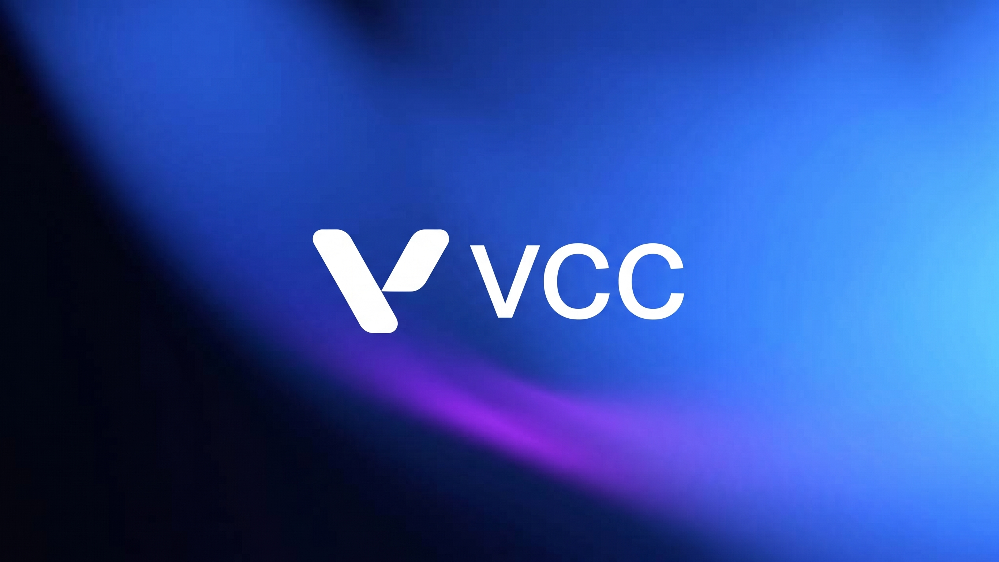

<p align="center">
  
</p>

<p align="center">
  
  
  
  
</p>

**vcc** is the Vertex C compiler: a from-scratch C11/C17 front end and native
backend written in Go, with no dependency on a host `cc`, `as`, or `ld`. It
reads C — or already-preprocessed `.i` — and writes a linked executable, an
object file, or VIR, its own typed IR. The preprocessor, code generator, object
encoders, and linkers are all in the box, so cross-compiling and cross-linking
to any supported target need no external toolchain installed.

It is a command and a library, running the same code: `vcc build` and
`vcc.Build("hello", "hello.c")` reach the same compiler, because the command is
a wrapper over the package at the root of this repository and has nothing of
its own.

Two things set it apart from `gcc` and `clang`. Diagnostics do not depend on
what the compiler does afterwards — the analysis runs before the IR exists, so
`vcc check` and `vcc build` report the same set — and a constraint violation
cites the paragraph of the standard it breaks. The dialect is ISO C: the GNU
extensions modern codebases actually depend on are accepted, and the rest are
rejected with a note rather than silently reinterpreted.

---

- [Install](#install)
- [Quick start](#quick-start)
- [Language](#language)
- [Targets](#targets)
- [CLI](#cli)
- [Go API](#go-api)
- [Architecture](#architecture)

---

## Install

```console
$ GOPROXY=direct go install github.com/vertex-language/vcc/cmd/vcc@latest
```

Requires Go 1.23 or newer. Nothing else.

---

## Quick start

```c
/* fib.c */
#include <stdio.h>

int fib(int n) {
    if (n <= 1) return n;
    return fib(n - 1) + fib(n - 2);
}

int main(void) {
    printf("fib(10) = %d\n", fib(10));
    return 0;
}
```

```console
$ vcc build -o fib fib.c
$ ./fib
fib(10) = 55

$ vcc run fib.c
fib(10) = 55

$ vcc check fib.c && echo ok
ok
```

The same thing from Go, at the import path you would guess:

```go
import "github.com/vertex-language/vcc"

err := vcc.Build("fib", "fib.c")   // compile and link
out, err := vcc.Run("fib.c")       // …or just run it: out is "fib(10) = 55\n"
```

`vcc build --emit vir` stops after lowering and prints the module. The IR is
typed, in SSA form, with explicit control flow — the same shape the backend
selects instructions from:

```console
$ vcc build --emit vir -o - fib.c
```

```vertex-ir
export func @_fib(%n i32) i32 nounwind {
@entry:
  %n_addr = ptr.alloc 4 align 4
  br @body

@body:
  i32.store %n, %n_addr
  %0 = i32.load %n_addr
  %1 = i32.const 1
  %2 = i32.sle %0, %1
  %3 = i32.zext_i1 %2
  %4 = i32.const 0
  %5 = i32.ne %3, %4
  brif %5, @if_then_10, @if_end_11

@if_then_10:
  %6 = i32.load %n_addr
  return %6

@if_end_11:
  %7 = i32.load %n_addr
  %8 = i32.const 1
  %9 = i32.sub %7, %8
  %10 = call @_fib(%9)
  %11 = i32.load %n_addr
  %12 = i32.const 2
  %13 = i32.sub %11, %12
  %14 = call @_fib(%13)
  %15 = i32.add %10, %14
  return %15
}
```

---

## Language

vcc compiles ISO C11 and C17 — the same language, C17 being C11 with the
defect reports folded in. Code that deviates from the standard is reported
with a citation; code that uses a GNU extension modern headers and codebases
rely on is compiled:

- `__attribute__((packed))`, `((aligned(n)))`, and the tolerated-spelling set
  system headers need
- `typeof` / `__typeof__` and statement expressions `({ ... })`
- `__auto_type`, for a plain identifier — the type of the initializer, which
  is what `({ __auto_type _a = (a); ... })` needs and `typeof` does not give
- `__builtin_types_compatible_p`, folded to a constant
- computed gotos — `&&label`, `goto *p`
- 128-bit integers (`__int128`) as storage — declared, laid out, pointed at
  and copied, since the headers need the width; arithmetic on one is refused
  with a diagnostic, there being no 128-bit register to compute in
- binary constants
- predefined identifiers and zero-length arrays

`inline` is §6.7.4's, including the part most compilers reach around:
`__inline`, `__inline__` and `__forceinline` are that specifier under gcc's and
MSVC's names rather than decoration to be discarded. A unit whose declarations
are all `inline` without `extern` emits nothing and says so; one that emits an
inline definition emits it weak, so a header that defines a function — which is
what `<stdio.h>` does on macOS — links from any number of units rather than
colliding with itself.

The preprocessor is vcc's own — ISO C11 §6.10, conforming and deterministic.
Output from `gcc -E` or `clang -E` is also accepted directly as `.i` input,
so the external-preprocessor workflow keeps working without being required.

The test suite is a corpus of self-checking C programs, each compiled,
linked, run, and cross-checked against `clang` for the same exit status and
output — see [`tests/`](tests/).

---

## Targets

vcc embeds its own object encoders and linkers, so every target is available
from any host with no cross-toolchain installed — and linking is not the
host-only rung it is elsewhere. `vcc env` prints the target resolved for the
current machine, along with the include and library search lists that go with
it.

| Target | Container | |
|---|---|---|
| `aarch64-macos`, `x86_64-macos` | Mach-O | |
| `aarch64-linux`, `x86_64-linux`, `i386-linux` | ELF | |
| `x86_64-elf`, `i386-elf` | ELF | bare metal: no OS, no libc |
| `x86_64-windows` | PE / COFF | |

Select one with `-target`:

```console
$ vcc build -target aarch64-linux -o app main.c
```

A target name decides two things at once — the type model the front end sizes
against, and the architecture, container and symbol prefix below the IR — and
both halves live in one table, so a name means one thing.

What a foreign target still needs is that platform's headers and libraries;
`-I`, `-L` and `-freestanding` are how you say where they are.

On Windows, vcc finds them itself. `%INCLUDE%` and `%LIB%` come first, so vcc
composes inside a Developer Command Prompt — and where they are unset, or set
to the toolset with no Windows SDK in them, which is what a machine whose SDK
arrived outside the Visual Studio installer gets, vcc locates the MSVC toolset
through `vswhere.exe` and the SDK under Windows Kits. So `vcc run hello.c`
works in an ordinary shell, `<windows.h>` opens, and `-l user32` adds user32
to the C runtime rather than replacing it. `vcc env` prints what was found.

What the target means is Microsoft's, because a layout is what a struct means
to everything else on the machine: `#pragma pack` is honoured, a bit-field
opens a new allocation unit under MSVC's rule rather than gcc's,
`__declspec(align(n))` is an alignment, and the entry point and subsystem
follow whichever of `main`, `wmain`, `WinMain` and `wWinMain` the program
defines. `_Thread_local` and `__declspec(thread)` are the thread's copy,
through PE's static model — the one target that has a model for them today.
Each of those was checked against `cl.exe` rather than against a reading of
the documentation, and `tests/platform/` keeps the comparison. SQLite, zlib,
Lua and stb build with it and run.

---

## CLI

Verb first, like `go` and `git` — `vcc build main.c`, not `vcc main.c`. Each
verb runs the same pipeline phases the compiler runs, so an inspection
command can never show something `vcc build` would reject.

| Command | |
|---|---|
| `vcc build` | compile and link; with `--emit`, stop earlier |
| `vcc run` | compile, link to a temp path, execute, forward the exit code |
| `vcc check` | preprocess, parse, and typecheck; no artifact |
| `vcc ast` | parse and dump the syntax tree |
| `vcc tokens` | dump the token stream |
| `vcc env` | print the resolved include list, library list, and predefined macros |

`--emit` replaces the `-E` / `-c` / `-S` mode flags with one option:

| | | like |
|---|---|---|
| `--emit exe` | compile and link (default) | |
| `--emit obj` | one object file per input | `cc -c` |
| `--emit vir` | the lowered IR module | |
| `--emit i` | preprocessed source | `cc -E` |

Standard flags carry over unchanged where a standard exists: `-o`, `-I`,
`-D`, `-U`, `-L`, `-l`, `-include`, `-static`. `-` means stdin or stdout
anywhere a path is accepted.

`-l` resolves the way every C toolchain resolves one: `-L` directories in the
order given, then the platform's own, and the shared form before the archive
unless `-static` asks for the archive alone. A name that resolves nowhere says
what it looked for and where. Inputs vcc does not compile — a `.o`, a `.a` —
are passed to the linker in place, in command-line order, because a static link
is order-sensitive and reordering it would be vcc deciding something you said.

---

## Go API

vcc is a library, and the root of this repository is the package:

```go
import "github.com/vertex-language/vcc"

err := vcc.Build("hello", "hello.c")   // compile and link, for this host
out, err := vcc.Run("hello.c")         // build to a temp path, run it, take stdout
```

Past those two shorthands everything is a `Compiler` and a parameter struct.
The zero `Compiler` builds for this host; a target, an include list, macros or
libraries are fields:

```go
import (
	"github.com/vertex-language/vcc"
	"github.com/vertex-language/vcc/preprocessor"
)

c := &vcc.Compiler{
	Target:      "x86_64-linux",
	IncludeDirs: []string{"include"},
	Defines:     []preprocessor.Predefine{vcc.Define("NDEBUG", "1")},
}

err := c.Build(vcc.BuildParams{
	Output:  "app",
	Inputs:  []vcc.Input{vcc.File("main.c"), vcc.File("util.c"), vcc.File("libfoo.a")},
	Libs:    []string{"m"},
	LibDirs: []string{"vendor/lib"},
})
```

Every phase is reachable on its own, and each rung is the one below it plus one
step — `Source`, `Preprocess`, `Parse`, `Check`, `IR`, `Object`, `Build`.
Diagnostics come back as values, sited in the file you wrote:

```go
diags, err := c.Check(vcc.File("main.c"))   // err means vcc could not run
for _, d := range diags {                   // d.Severity, d.Site, d.Message
	fmt.Println(d)
}
```

Source does not have to be a file. `vcc.Text(name, data)` compiles bytes the
caller already has, an object comes back as bytes, and the linkers take bytes —
so a build can run start to finish without touching the filesystem:

```go
obj, diags, err := c.Object(vcc.Text("gen.c", src))
prog, err := c.Program(vcc.BuildParams{Inputs: []vcc.Input{vcc.ObjectBytes("gen.o", obj)}})
defer prog.Close()

cmd := prog.Command("--flag")   // an unstarted *exec.Cmd: running is os/exec's job
cmd.Stdout = &buf
err = cmd.Run()
```

For tooling that wants only the front end, the sub-packages are unchanged and
cost nothing else. Parse a translation unit and walk exactly the tree the
compiler sees:

```go
import (
	"github.com/vertex-language/vcc/ast"
	"github.com/vertex-language/vcc/parser"
	"github.com/vertex-language/vcc/token"
)

unit := token.NewFile("a.c", src) // src is preprocessed C, []byte
file, diags := parser.ParseFile(unit, parser.DefaultMode)
defer file.Release()

ast.Inspect(file, func(n ast.Node) bool {
	// tooling logic here
	return true
})
```

`ParseFile` runs the scanner itself and always returns a non-nil tree — a
partial parse yields `Bad*` placeholder nodes rather than nothing. See
[`parser/`](parser/) and [`ast/`](ast/).

---

## Architecture

The pipeline mirrors the ISO C translation phases, each stage its own
package with minimal cross-dependencies:

```
scanner → preprocessor → parser → analyzer → lower → vcc
  C tokens   phase 4       AST      types &    typed    isel, encode,
                                    scopes     AST→VIR   link
```

The root package is the composition: it runs the phases in order, holds the
target tables, and carries a module through instruction selection, object
writing and linking. `cli` is a wrapper over it, and so is any other program
that wants a C compiler.

| Package | |
|---|---|
| [`token/`](token/) | lexical vocabulary, source positions, file model |
| [`scanner/`](scanner/) | tokenization (phase 3) |
| [`preprocessor/`](preprocessor/) | directives, macro expansion, header resolution (phase 4) |
| [`parser/`](parser/) · [`ast/`](ast/) | tokens to AST; the syntax tree |
| [`analyzer/`](analyzer/) · [`types/`](types/) | semantic analysis, scopes, constraints, layout |
| [`lower/`](lower/) | typed AST to VIR |
| [`.`](.) | the library: the phases composed, the target tables, isel, object writing, linking |
| [`sysroot/`](sysroot/) | where this host keeps a target's headers and libraries; the built-in headers |
| [`cli/`](cli/) · [`cmd/vcc/`](cmd/vcc/) | verb dispatch and the executable |

Everything downstream of `lower` — instruction selection and encoding for
AMD64, ARM64, and i386, and the ELF, Mach-O, and PE writers and linkers —
lives in independent `vertex-language` repositories that the root package
composes into a final binary. The files that do it (`target.go`, `codegen.go`,
`link.go`, `register.go`) import those repositories and nothing of vcc's front
end, so a second front end targeting VIR could take them as they are.

---

MIT licensed. See [LICENSE](LICENSE).
